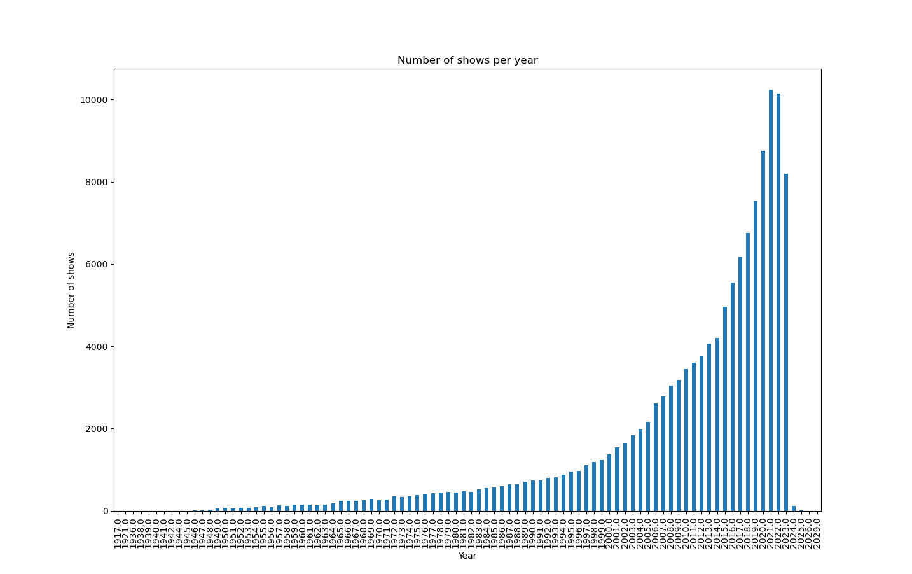
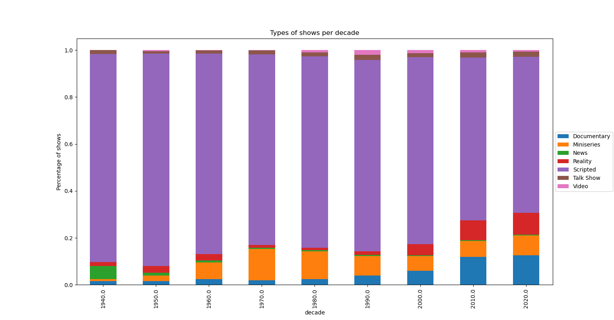
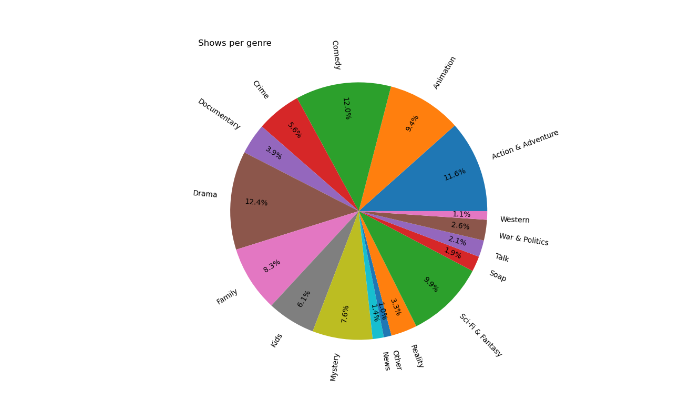

# Global report

In this project we worked on the Movie Database (TMDB) to get some insights about more than 159.000 tv shows.

In summary:
## 0. Uncompressing and reading the data
We have written code to uncompress and read the data from the TMBD.
## 1. Processing the data
We have seen the top shows with most days in air:
| id | name | days_on_air |
|:---:|:---:|:---:|
| 637 | CBS Evening News | 30043 days |
| 215684 | Neujahrskonzert der Wiener Philharmoniker | 29950 days |
| 71494 | Golden Globe Awards | 28845 days |
| 23393 | BBC Proms | 27762 days |
| 4496 | Meet the Press | 27555 days |
| 5730 | Macy's Thanksgiving Day Parade | 27027 days |
| 26183 | The BAFTA Awards | 26929 days |
| 28464 | The Emmy Awards | 26893 days |
| 1770 | ABC World News | 26805 days |
| 66550 | Sanremo Music Festival | 26311 days |


We have seen some entries with the links to their posters:

| shows | poster URL |  |
|---|---|---|
| Game of Thrones | http://www.hbo.com/game-of-thrones/1XS1oqL89opfnbLl8WnZY1O1uJx.jpg |
| Money Heist | https://www.netflix.com/title/80192098/reEMJA1uzscCbkpeRJeTT2bjqUp.jpg |
| Stranger Things | https://www.netflix.com/title/80057281/49WJfeN0moxb9IPfGn8AIqMGskD.jpg |
| The Walking Dead | http://www.amc.com/shows/the-walking-dead--1002293/n7PVu0hSz2sAsVekpOIoCnkWlbn.jpg |
| Lucifer | https://www.netflix.com/title/80057918/ekZobS8isE6mA53RAiGDG93hBxL.jpg |

(* *Most of the links have expired already*)

## Filtering the data
We have applied some filters to see the movies in english language related to mystery or crime, which are many and are not all are shown here, but some:
Breaking Bad, The Act, Sherlock, Marvel's Daredevil, The Mentalist, Gotham, etc.


We have listed the shows which started on 2023 and have been already cancelled:
| id | name | first_air_date | status |
|:---:|:---:|:---:|:---:|
| 1983 | Lockwood & Co. | 2023-01-27 | Canceled |
| 2206 | The Idol | 2023-06-04 | Canceled |
| 3003 | Gotham Knights | 2023-03-14 | Canceled |
| 4443 | True Lies | 2023-03-01 | Canceled |
| 4601 | Sky High: The Series | 2023-03-17 | Canceled |
| 5396 | High Desert | 2023-05-16 | Canceled |
| 5876 | Grease: Rise of the Pink Ladies | 2023-04-06 | Canceled |
| 5880 | The Watchful Eye | 2023-01-30 | Canceled |
| 5908 | The Company You Keep | 2023-02-19 | Canceled |
| 6227 | Dear Edward | 2023-02-02 | Canceled |
| 6734 | City on Fire | 2023-05-11 | Canceled |
| 7362 | The Head of Joaquín Murrieta | 2023-02-17 | Canceled |
| 8488 | Freeridge | 2023-02-02 | Canceled |
| 9002 | Up Here | 2023-03-24 | Canceled |
| 13253 | A Town Called Malice | 2023-03-16 | Canceled |
| 17265 | Slip | 2023-04-21 | Canceled |
| 19918 | The Low Tone Club | 2023-02-22 | Canceled |
| 20460 | Monster Factory | 2023-03-16 | Canceled |
| 20852 | @Gina Yei: #WithAllMyHeartAndMore | 2023-01-11 | Canceled |
| 21691 | Bling Empire: New York | 2023-01-20 | Canceled |

We have seen some the shows which have japanese as language, with their original name and their networks and production companies, for example:
|  | id | name | original_name | networks | production_companies |
|---|---|---|---|---|---|
| 24 | 31910 | Naruto Shippūden | ナルト 疾風伝 | TV Tokyo | TV Tokyo, Pierrot, Sound Box |
| 34 | 85937 | Demon Slayer: Kimetsu no Yaiba | 鬼滅の刃 | Fuji TV, Gunma TV, Tokyo MX, BS11, Tokai Television Broadcasting, Kansai   TV, Tochigi TV, Fukui TV, Hokkaido Cultural Broadcasting, Iwate Menkoi   Television, Television Oita System, Sendai Television, SAGA TV, Ishikawa TV,   Television Nishinippon, OHK, Kochi Sun Sun Broadcasting, Television Shin   Hiroshima System, TV Shizuoka, UMK TV Miyazaki, NST, NBS, Sakuranbo TV, TSK,   Ehime Broadcasting, KTS, Fukushima TV, NIB, AKT, Toyama Television, TV   Kumamoto, Okinawa Television Broadcasting | ufotable, Aniplex, Shueisha |
| 36 | 1429 | Attack on Titan | 進撃の巨人 | MBS, NHK G, Tokyo MX | Production I.G, MAPPA, WIT STUDIO, Pony Canyon, Techno Sound, Kodansha,   dentsu, MBS, Pony Canyon Enterprise |
| 39 | 46260 | Naruto | ナルト | TV Tokyo | Pierrot, Sound Box |
| 45 | 62104 | The Seven Deadly Sins | 七つの大罪 | tv asahi, MBS, TV Tokyo, TBS, CBC, TV Aichi, TVQ, TV Osaka, Tulip   Television, TVh, SBC, TSC, BSN, tys, Nagasaki Broadcasting Company, HBC, RKK   Kumamoto Broadcasting, i-Television, SBS TV, IBC Iwate Broadcasting,   Broadcasting System of San-in, Hokuriku Broadcasting, Oita Broadcasting   System, TV-U Fukushima, RSK, TV-U Yamagata, Tohoku Broadcasting, RKB, TV   Kochi Broadcasting, Ryukyu Broadcasting, TV Yamanashi, RCC, MRT Miyazaki   Broadcasting, ATV, MBC South Japan Broadcasting | A-1 Pictures, Studio Deen |
| 46 | 62715 | Dragon Ball Super | ドラゴンボール超（スーパー） | Fuji TV | Toei Company, Toei Animation, Fuji Television Network, Fizz Sound   Creation |
| 49 | 65930 | My Hero Academia | 僕のヒーローアカデミア | Nippon TV, MBS, TBS, YTV | BONES, Shueisha, movic, dentsu, Yomiuri Telecasting Corporation, Sony   Music Entertainment (Japan), TOHO |
| 58 | 12971 | Dragon Ball Z | ドラゴンボールゼット | Fuji TV | Fuji Television Network, Mini Art, Toei Animation, Fizz Sound Creation |
| 60 | 37854 |  | ワンピース | Fuji TV | Toei Animation, Fuji Television Network, Avex Trax, Shueisha, Asatsu-DK |
| 76 | 13916 | Death Note | DEATH NOTE | Nippon TV | Madhouse |
| 89 | 63926 | One-Punch Man | ワンパンマン | TV Tokyo, TV Aichi, TV Osaka | Madhouse, J.C.STAFF, Bandai Visual, Asatsu-DK, East Japan Marketing &   Communications, Shueisha, Lantis, Banpresto, Good Smile Company, TV Tokyo |
| 99 | 80020 | Super Dragon Ball Heroes | スーパードラゴンボールヒーローズ | Fuji TV | Toei Animation, Fuji Television Network |
| 108 | 95479 | Jujutsu Kaisen | 呪術廻戦 | MBS, TBS, CBC, Tulip Television, SBC, BSN, tys, HBC, RKK Kumamoto   Broadcasting, Nagasaki Culture Telecasting Corporation, i-Television, SBS TV,   IBC Iwate Broadcasting, Broadcasting System of San-in, Hokuriku Broadcasting,   Oita Broadcasting System, TV-U Fukushima, RSK, TV-U Yamagata, Tohoku   Broadcasting, RKB, TV Kochi Broadcasting, Ryukyu Broadcasting, TV Yamanashi,   RCC, MRT Miyazaki Broadcasting, ATV, MBC South Japan Broadcasting | MAPPA, Sumzap, dugout, Shueisha, MBS, TOHO |
| 109 | 12609 | Dragon Ball | ドラゴンボール | Fuji TV | Toei Animation, Cloverway, Inc. |
| 134 | 70881 | Boruto: Naruto Next Generations | BORUTO-ボルト- NARUTO NEXT GENERATIONS | TV Tokyo | Pierrot |
| 158 | 61374 | Tokyo Ghoul | 東京喰種トーキョーグール | Tokyo MX | Pierrot, Marvelous, TC Entertainment |


## Plotting
Fianlly we have produced some plots to get more insights into the data.

To see them all check: 
```
movie_project/movie_project/reports/
```

1. We have seen that the number of TVs shows has increased exponenitally:




2. We have analysed the types of shows for the las decades:



We can see that the distribution has changed throughout the years. To highlight are the increase of Miniseries (specially in the 70s and 80s), of Documentaris, and of Reality shows (this in particular since the 2000s).
We can also see that News were important in the 40s but not any longer. In general the relative increase of Miniseries, Realities and Documentaries has been to the expense of scripted shows.

3. We generated a general overview of the shows per genre. Dominating genres are Comedy, Sci-Fi, Drama and Action.



### Other/Extra:
A part from the beforementioned, we have generated a full python package, using an IDE (VSCode), using version control (git), generated unit tests, and checked for lint using pylint, and coverage using coverage.

### Bibliography/Resources:
[VSCode](https://code.visualstudio.com/)

[Git](https://git-scm.com/) and [GitHub](https://github.com/ulisesrey)

[PyLint](https://pypi.org/project/pylint/)

[Coverage](https://coverage.readthedocs.io/en/7.4.1/)

[Unit Test](https://docs.python.org/3/library/unittest.html)
